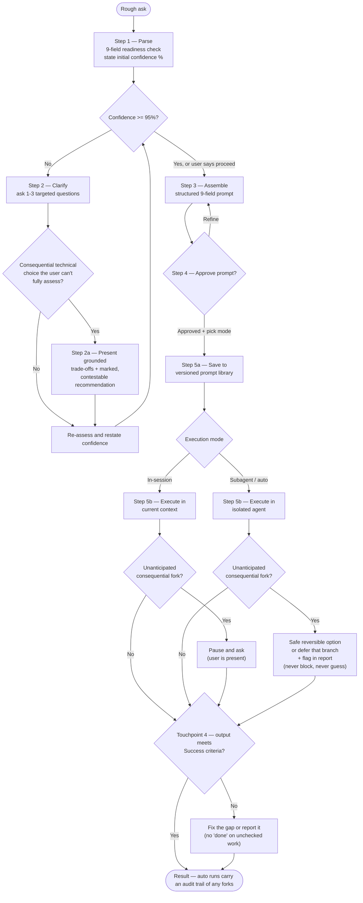

# Promptize

## Idea

Promptize is a **confidence-gated intent builder**. It takes a rough, ambiguous ask and —
before anything is executed — turns it into a structured, reviewable prompt. It refuses to
proceed until it understands the intent to a high confidence threshold (`>= 95%`), then
executes the approved prompt and saves it to a versioned library for reuse.

In one line: **clarify and confirm intent first, then act** — a deliberate gate placed in
front of execution.

## Design principle — no consequential decision without informed gating

One principle, applied at four touchpoints — gating every consequential decision from intent through completion:

1. **The user's intent** — the clarify loop never executes on a guessed intent. *(Guards against goal drift before it can start.)*
2. **The user's technical choices** — a consequential choice the user can't fully assess is
   met with grounded trade-offs + a marked, contestable recommendation, not an open question.
3. **The agent's mid-execution forks** — an unanticipated consequential fork is never resolved
   by a silent guess and never blocks an unattended run: in-session it may pause and ask; in
   auto/subagent mode it takes the safest reversible option (or defers that branch) and flags
   it in the final report.
4. **The agent's "done" declaration** — before declaring complete, verify the output against the
   *Success criteria*. Counters *agentic laziness* (stopping early); only partial against
   *self-preferential bias* (an agent grading its own work — the full cure is an independent
   reviewer = orchestration, out of scope).

Same move every time: structure and inform a decision *before* it is committed — whether the
decider is the user or the executing agent.

## Two phases (they are separate)

Promptize **builds** a prompt, then **executes** it. These are distinct phases — and in
subagent mode the execution runs in an **isolated** process with no access to the conversation:

- **Build (Steps 1–4):** clarify loop, confidence gate, assembly, approval. The `>= 95%`
  threshold lives *here* — it is confidence that the prompt captures intent, judged before approval.
- **Execute (Step 5b):** run the approved prompt, in-session or as an isolated subagent.

The `>= 95%` says nothing about execution: a well-built prompt can still meet a runtime surprise
it never anticipated (a file that doesn't exist, two configs where one was assumed). That is what
touchpoint 3 handles.

## Architecture

**Flow** (plain text — renders anywhere):

```
  ROUGH ASK
     |
     v
  1. PARSE  ->  score 9-field readiness  ->  confidence %
     |
     v
  [ GATE 1 : the user's INTENT ]
     2. CLARIFY - 1-3 questions, loop until >=95% or "procede"
     |
     v
  [ GATE 2 : the user's TECHNICAL CHOICES ]
     2a. a choice the user can't fully assess?
         -> grounded TRADE-OFFS + marked, contestable RECOMMENDATION
            (not an open question)
     |
     v
  3. ASSEMBLE  ->  4. APPROVE (pick mode)  ->  5a. SAVE  ->  5b. EXECUTE
     |
     v
  [ GATE 3 : the agent's MID-EXECUTION FORKS ]   (never guess silently)
     unanticipated consequential fork?
        in-session     -> pause & ask
        auto/subagent  -> safest reversible option, or defer that branch,
                          + record & flag in the final report  (never block)
     |
     v
  [ GATE 4 : the agent's "DONE" DECLARATION ]
     verify output against Success criteria before declaring complete
        -> falls short? fix the gap or report it   (no "done" on unchecked work)
     |
     v
  RESULT   (auto runs: + audit trail of any forks)
```

**Same flow as a rendered diagram** (GitHub / Mermaid-aware viewers):



## The ideal prompt

The structured output of step 3 — what `/promptize` hands to execution:

```
  +-- THE IDEAL PROMPT : structured output of /promptize ---------
  |
  |  1. GOAL             : the outcome, one sentence (what, not how)
  |  2. CONTEXT          : prior state, constraints, why now
  |  3. INPUTS           : concrete files / refs to read first
  |  4. EXPECTED OUTPUT  : format / destination / length
  |  5. SCOPE            : IN  > what to do
  |                      : OUT > explicit non-goals
  |  6. CONSTRAINTS      : what NOT to do / rules /
  |                      : escalation triggers (consequential forks)
  |  7. SUCCESS CRITERIA : how you verify it worked
  |  8. OPEN ASSUMPTIONS : what we assume unverified + what to do if false
  |  9. EXAMPLES         : (optional) sample in/out, edge cases
  |
  +--------------------------------------------------------------
```

Unused fields are dropped; *Examples* and the *Constraints* escalation triggers are optional.
The confidence % is not a field here — it lives in the saved file's frontmatter
(`confidence_at_approval`); the prompt body carries *assumptions*, which are actionable.

## Execution modes (in-session vs subagent)

Once the prompt is approved, it runs in one of two modes:

| Mode | What it is | When to use |
|------|------------|-------------|
| **In-session** *(default)* | Runs in the current conversation; every tool call and step is visible, and you can correct it live. | Normal use. |
| **Subagent** | Spawns a fresh, **isolated** Claude (the harness's subagent / `Task` primitive) whose only input is the prompt — no access to the conversation. It runs the whole task alone and returns **one consolidated report**. | Big jobs (long research, large audits, exploratory refactors) where the intermediate noise should stay out of the main conversation. |

A **subagent** is simply a separate Claude working in its own context window. The benefit is isolation (your main conversation stays clean); the cost is that it **cannot ask you anything mid-run**.

Because of that, the confidence gate is **asymmetric**:
- **In-session** may proceed below 95% with documented *Open assumptions* — you are watching and can correct live.
- **Subagent requires the full ≥95%** and a self-sufficient brief — there is no live correction once it runs isolated, so sub-threshold work stays in-session.

And touchpoint-3 governance is **enforced, not just instructed, where the harness allows**: a subagent is dispatched with permissions scoped to the task (read-only for research/audit; no destructive ops unless required), so "never act irreversibly on a guess" becomes a hard limit, not only a prompt instruction.

> **Portability — graceful degradation.** The subagent primitive is Claude-specific (Claude Code's `Agent` / `Task` tool). The build phase and in-session execution port to *any* Agent-Skills-compatible tool. Subagent mode is **capability-gated**: where the host agent lacks a subagent/Task primitive, Promptize does **not** fail — it falls back to in-session and says so. So "Agent Skills-compatible" stays honest: the core runs everywhere; isolated delegation is a Claude-best *enhancement*, not a hard dependency.

## Fork handling at execution (touchpoint 3)

A "fork" is an unanticipated, **consequential** decision the prompt did not cover — irreversible
or materially outcome-changing. Trivial doubts are *not* forks; the executor uses judgement and
proceeds (this is what keeps Promptize from becoming fussy). On a real fork the executor **never
guesses silently**, and behaviour depends on mode:

| Mode                | On a consequential fork                                                                                                                                                              |
|---------------------|-------------------------------------------------------------------------------------------------------------------------------------------------------------------------------------|
| **In-session**      | Pause and ask — the user is present, interruption is cheap.                                                                                                                          |
| **Auto / subagent** | **Never block.** Take the safest reversible option; if irreversible with no safe default, defer just that branch (skip it, finish the rest). Record the fork and flag it in the final report. |

The point: an unattended run still **completes** — fire-and-forget is preserved — but it returns
an **audit trail of judgement calls** instead of either blocking overnight or guessing silently.
This is the governance thesis applied to the agent's own decisions: **autonomous *and* accountable.**

## Stages

- **1 — Parse:** read the rough ask, score readiness across the 9 fields, state an initial confidence %.
- **2 — Clarify:** ask 1–3 targeted questions per turn, restating confidence after each answer; loop until `>= 95%` or the user says proceed.
- **2a — Informed choice:** for a consequential technical choice the user can't fully assess, present grounded trade-offs + a marked recommendation instead of an open question — sourced, not confabulated; reasoning exposed and contestable. Delivered via `AskUserQuestion`'s option-picker when the host provides it (recommended option marked `(Recommended)`); falls back to prose questions otherwise.
- **3 — Assemble:** compose the structured prompt (see *The ideal prompt* above). Unused fields are dropped.
- **4 — Approve:** present the prompt for review and pick an execution mode (in-session or isolated subagent); refine until approved.
- **5 — Save & execute:** persist the approved prompt to a versioned library, then execute it in the chosen mode. At an unanticipated consequential fork, fork handling (touchpoint 3) applies — never a silent guess, never a blocked unattended run. And before declaring done (touchpoint 4), the output is checked against the *Success criteria* — no "done" on unchecked work.

> Implemented as a Claude Code skill (`SKILL.md`). The underlying pattern — informed gating
> before a decision is committed — is ecosystem-agnostic.
